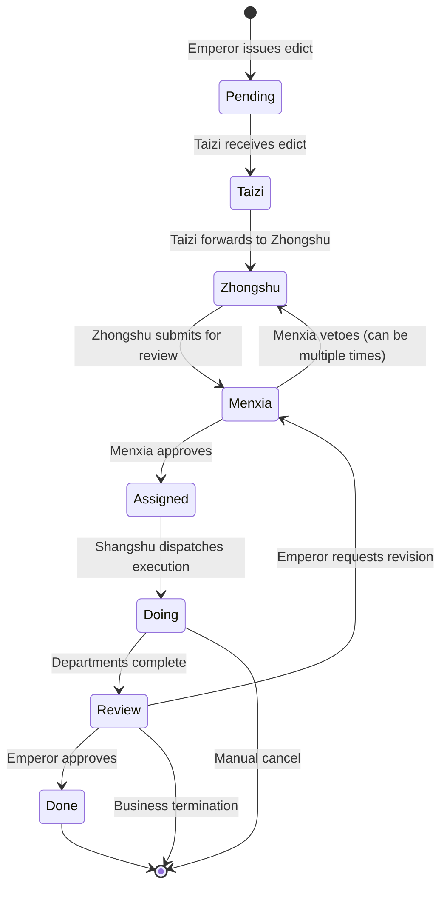

# Three Departments & Six Ministries Task Dispatch & Flow System · Business and Technical Architecture

> This document details how the "Three Departments & Six Ministries" project handles the complete task dispatch and flow for complex multi-agent collaboration, from **business institutional design** to **code implementation details**. This is an **institutionalized AI multi-agent framework**, not a traditional free-discussion collaboration system.

**Document Overview**

```
━━━━━━━━━━━━━━━━━━━━━━━━━━━━━━━━━━━━━━━━━━━━━━━━━━━━━━━━━━━━━
Business Layer: Imperial Governance Model
  ├─ Checks and Balances: Emperor → Taizi → Zhongshu → Menxia → Shangshu → Six Ministries
  ├─ Institutional Constraints: no bypassing levels, strict state progression, Menxia must review
  └─ Quality Assurance: veto and rework, real-time observability, emergency intervention
━━━━━━━━━━━━━━━━━━━━━━━━━━━━━━━━━━━━━━━━━━━━━━━━━━━━━━━━━━━━━
Technical Layer: OpenClaw Multi-Agent Orchestration
  ├─ State Machine: 9 states (Pending → Taizi → Zhongshu → Menxia → Assigned → Doing/Next → Review → Done/Cancelled)
  ├─ Data Fusion: flow_log + progress_log + session JSONL → unified activity stream
  ├─ Permission Matrix: strict subagent call permission control
  └─ Scheduler Layer: automatic dispatch, timeout retry, stall escalation, auto rollback
━━━━━━━━━━━━━━━━━━━━━━━━━━━━━━━━━━━━━━━━━━━━━━━━━━━━━━━━━━━━━
Observability Layer: React Kanban + Real-time API
  ├─ Task Board: 10 view panels (all/by-state/by-department/by-priority etc.)
  ├─ Activity Stream: 59 entries/task of mixed activity records (thinking, tool calls, state transitions)
  └─ Online Status: Agent real-time node detection + heartbeat wake-up mechanism
━━━━━━━━━━━━━━━━━━━━━━━━━━━━━━━━━━━━━━━━━━━━━━━━━━━━━━━━━━━━━
```

---

## 📚 Part One: Business Architecture

### 1.1 Imperial Governance: The Design Philosophy of Checks and Balances

#### Core Concept

Traditional multi-agent frameworks (like CrewAI, AutoGen) use a **"free collaboration"** model:
- Agents autonomously choose collaboration partners
- Framework only provides communication channels
- Quality control entirely depends on Agent intelligence
- **Problem**: Agents easily manufacture fake data for each other, duplicate work, and plan quality is unguaranteed

**Three Departments & Six Ministries** uses an **"institutional collaboration"** model, modeled on the ancient imperial bureaucracy:

```
              Emperor
              (User)
               │
               ↓
             Taizi (Taizi)
        [Triage Officer, overall message intake]
      ├─ Identify: is this an edict or casual chat?
      ├─ Act: reply directly to chat || create task → forward to Zhongshu
      └─ Permission: can only call Zhongshu
               │
               ↓
           Zhongshu (Zhongshu)
      [Planning Officer, overall plan drafting]
      ├─ Analyze requirements after receiving edict
      ├─ Break down into sub-tasks (todos)
      ├─ Call Menxia for review OR consult Shangshu
      └─ Permission: can only call Menxia + Shangshu
               │
               ↓
           Menxia (Menxia)
        [Review Officer, quality guardian]
      ├─ Review Zhongshu's plan (feasibility, completeness, risk)
      ├─ Approve OR Veto (including revision suggestions)
      ├─ If vetoed → return to Zhongshu for revision → re-review (max 3 rounds)
      └─ Permission: can only call Shangshu + callback to Zhongshu
               │
         (✅ Approved)
               │
               ↓
           Shangshu (Shangshu)
        [Dispatch Officer, overall execution commander]
      ├─ Receives approved plan
      ├─ Analyzes which department to dispatch to
      ├─ Calls Six Ministries (Libu/Hubu/Bingbu/Xingbu/Gongbu/Libu_hr) to execute
      ├─ Monitors each department's progress → summarizes results
      └─ Permission: can only call Six Ministries (cannot overstep and call Zhongshu)
               │
               ├─ Libu (Libu)      - Documentation Officer
               ├─ Hubu (Hubu)      - Data Analysis Officer
               ├─ Bingbu (Bingbu)  - Code Implementation Officer
               ├─ Xingbu (Xingbu)  - Testing & Audit Officer
               ├─ Gongbu (Gongbu)  - Infrastructure Officer
               └─ Libu_hr (Libu_hr) - Human Resources Officer
               │
         (departments execute in parallel)
               ↓
           Shangshu · Summary
      ├─ Collect results from Six Ministries
      ├─ State transitions to Review
      ├─ Callback to Zhongshu to report to Emperor
               │
               ↓
           Zhongshu · Report Back
      ├─ Summarize observations, conclusions, suggestions
      ├─ State transitions to Done
      └─ Reply Feishu message to Emperor
```

#### 4 Institutional Guarantees

| Guarantee Mechanism | Implementation Details | Protection Effect |
|---------|---------|---------|
| **Institutional Review** | Menxia must review all Zhongshu plans, cannot be skipped | Prevents Agents from executing carelessly, ensures plan feasibility |
| **Checks and Balances** | Permission matrix: who can call whom is strictly defined | Prevents power abuse (e.g., Shangshu overstepping to tell Zhongshu to revise plans) |
| **Fully Observable** | 10 task board panels + 59 activities/task | Real-time view of where a task is stuck, who is working, current work status |
| **Real-time Intervable** | One-click stop/cancel/resume/advance in kanban | Can immediately correct when emergencies arise (e.g., Agent going in wrong direction) |

---

### 1.2 Complete Task Flow Process

#### Process Diagram



#### Specific Key Paths

**✅ Ideal Path** (no stalls, completed in 4-5 days)

```
DAY 1:
  10:00 - Emperor via Feishu: "Write a complete automated testing plan for Three Departments & Six Ministries"
          Taizi receives edict. state = Taizi, org = Taizi
          Auto-dispatches taizi agent → processes this edict
  
  10:30 - Taizi finishes triage. Determines it's a "work edict" (not casual chat)
          Creates task JJC-20260228-E2E
          flow_log records: "Emperor → Taizi: issue edict"
          state: Taizi → Zhongshu, org: Taizi → Zhongshu
          Auto-dispatches zhongshu agent

DAY 2:
  09:00 - Zhongshu receives edict. Begins planning
          Reports progress: "Analyzing test requirements, breaking down into unit/integration/E2E three layers"
          progress_log records: "Zhongshu: analyzing requirements"
          
  15:00 - Zhongshu completes plan
          todos snapshot: Requirement analysis✅, Plan design✅, Awaiting review🔄
          flow_log records: "Zhongshu → Menxia: plan submitted for review"
          state: Zhongshu → Menxia, org: Zhongshu → Menxia
          Auto-dispatches menxia agent

DAY 3:
  09:00 - Menxia begins review
          Progress report: "Now reviewing plan completeness and risks"
          
  14:00 - Menxia finishes review
          Determination: "Plan is feasible, but missing tests for _infer_agent_id_from_runtime function"
          Action: ✅ Approve (with revision suggestions)
          flow_log records: "Menxia → Shangshu: ✅ Approved (5 suggestions)"
          state: Menxia → Assigned, org: Menxia → Shangshu
          OPTIONAL: Zhongshu receives suggestions, proactively optimizes plan
          Auto-dispatches shangshu agent

DAY 4:
  10:00 - Shangshu receives approved plan
          Analysis: "This test plan should be dispatched to Gongbu+Xingbu+Libu jointly"
          flow_log records: "Shangshu → Six Ministries: dispatch execution (Bingbu+Libu_hr cooperation)"
          state: Assigned → Doing, org: Shangshu → Bingbu+Xingbu+Libu
          Auto-dispatches bingbu/xingbu/libu three agents (in parallel)

DAY 4-5:
  (departments execute in parallel)
  - Bingbu: implements pytest + unittest test framework
  - Xingbu: writes tests covering all critical functions
  - Libu: organizes test documentation and use case descriptions
  
  Real-time reports (hourly progress):
  - Bingbu: "✅ Implemented 16 unit tests"
  - Xingbu: "🔄 Writing integration tests (8/12 complete)"
  - Libu: "Waiting for Bingbu to finish before writing report"

DAY 5:
  14:00 - All departments complete
          state: Doing → Review, org: Bingbu → Shangshu
          Shangshu summarizes: "All tests completed, pass rate 98.5%"
          Forwards back to Zhongshu
          
  15:00 - Zhongshu reports back to Emperor
          state: Review → Done
          Template reply via Feishu, including final output link and summary
```

**❌ Setback Path** (with veto and retry, 6-7 days)

```
DAY 2 same as above

DAY 3 [Veto scenario]:
  14:00 - Menxia finishes review
          Determination: "Plan incomplete, missing performance tests + stress tests"
          Action: 🚫 Veto
          review_round += 1
          flow_log records: "Menxia → Zhongshu: 🚫 Vetoed (need to add performance tests)"
          state: Menxia → Zhongshu  # return to Zhongshu for revision
          Auto-dispatches zhongshu agent (re-plan)

DAY 3-4:
  16:00 - Zhongshu receives veto notification (agent woken up)
          Analyzes improvement suggestions, adds performance testing plan
          progress: "Integrated performance testing requirements, revised plan as follows..."
          flow_log records: "Zhongshu → Menxia: revised plan (2nd round review)"
          state: Zhongshu → Menxia
          Auto-dispatches menxia agent

  18:00 - Menxia re-reviews
          Determination: "✅ Passes this time"
          flow_log records: "Menxia → Shangshu: ✅ Approved (2nd round)"
          state: Menxia → Assigned → Doing
          Subsequent same as ideal path...

DAY 7: All complete (1-2 days later than ideal path)
```

---

### 1.3 Task Specification & Business Contract

#### Task Schema Field Description

```json
{
  "id": "JJC-20260228-E2E",          // Task globally unique ID (JJC-date-sequence)
  "title": "Write complete automated testing plan for Three Departments & Six Ministries",
  "official": "Zhongshu Minister",   // Responsible official
  "org": "Zhongshu",                 // Current responsible department
  "state": "Assigned",               // Current state (see _STATE_FLOW)
  
  // ──── Quality & Constraints ────
  "priority": "normal",              // Priority: critical/high/normal/low
  "block": "None",                   // Current blocker reason (e.g. "waiting for Gongbu feedback")
  "reviewRound": 2,                  // Menxia review round number
  "_prev_state": "Menxia",           // If stopped, records previous state for resume
  
  // ──── Business Output ────
  "output": "",                      // Final task deliverable (URL/file path/summary)
  "ac": "",                          // Acceptance Criteria
  
  // ──── Flow Records ────
  "flow_log": [
    {
      "at": "2026-02-28T10:00:00Z",
      "from": "Emperor",
      "to": "Taizi",
      "remark": "Issue edict: Write complete automated testing plan for Three Departments & Six Ministries"
    },
    {
      "at": "2026-02-28T10:30:00Z",
      "from": "Taizi",
      "to": "Zhongshu",
      "remark": "Triage complete → relay edict"
    },
    {
      "at": "2026-02-28T15:00:00Z",
      "from": "Zhongshu",
      "to": "Menxia",
      "remark": "Plan submitted for review"
    },
    {
      "at": "2026-03-01T09:00:00Z",
      "from": "Menxia",
      "to": "Zhongshu",
      "remark": "🚫 Vetoed: need to add performance tests"
    },
    {
      "at": "2026-03-01T15:00:00Z",
      "from": "Zhongshu",
      "to": "Menxia",
      "remark": "Revised plan (2nd round review)"
    },
    {
      "at": "2026-03-01T20:00:00Z",
      "from": "Menxia",
      "to": "Shangshu",
      "remark": "✅ Approved (2nd round, 5 suggestions adopted)"
    }
  ],
  
  // ──── Agent Real-time Reports ────
  "progress_log": [
    {
      "at": "2026-02-28T10:35:00Z",
      "agent": "zhongshu",              // reporting agent
      "agentLabel": "Zhongshu",
      "text": "Edict received. Analyzing test requirements, drafting three-layer test plan...",
      "state": "Zhongshu",              // state snapshot at time of report
      "org": "Zhongshu",
      "tokens": 4500,                   // resource consumption
      "cost": 0.0045,
      "elapsed": 120,
      "todos": [                        // todo task snapshot
        {"id": "1", "title": "Requirements analysis", "status": "completed"},
        {"id": "2", "title": "Plan design", "status": "in-progress"},
        {"id": "3", "title": "Awaiting review", "status": "not-started"}
      ]
    },
    // ... more progress_log entries ...
  ],
  
  // ──── Scheduler Metadata ────
  "_scheduler": {
    "enabled": true,
    "stallThresholdSec": 180,         // auto-escalate after 180 seconds of stalling
    "maxRetry": 1,                    // max 1 automatic retry
    "retryCount": 0,
    "escalationLevel": 0,             // 0=no escalation 1=Menxia coordination 2=Shangshu coordination
    "lastProgressAt": "2026-03-01T20:00:00Z",
    "stallSince": null,               // when stalling began
    "lastDispatchStatus": "success",  // queued|success|failed|timeout|error
    "snapshot": {
      "state": "Assigned",
      "org": "Shangshu",
      "note": "review-before-approve"
    }
  },
  
  // ──── Lifecycle ────
  "archived": false,                 // whether archived
  "now": "Menxia approved, transferring to Shangshu for dispatch",  // current real-time status description
  "updatedAt": "2026-03-01T20:00:00Z"
}
```

#### Business Contract

| Contract | Meaning | Consequence of Violation |
|------|------|---------|
| **No level-skipping** | Taizi can only call Zhongshu, Zhongshu can only call Menxia/Shangshu, Six Ministries cannot call outside | Unauthorized calls rejected, system auto-intercepts |
| **State one-way progression** | Pending → Taizi → Zhongshu → ... → Done, cannot skip or regress | Can only return to previous step via review_action(reject) |
| **Menxia must review** | All plans proposed by Zhongshu must go through Menxia review, cannot be skipped | Zhongshu cannot go directly to Shangshu, Menxia must be in the chain |
| **Done is immutable** | Once task enters Done/Cancelled, state cannot be changed | If modification needed, create new task or cancel and recreate |
| **task_id uniqueness** | JJC-date-sequence globally unique, same day same task not duplicated | Kanban prevents duplicates, auto-dedup |
| **Resource consumption transparency** | Each progress report must include tokens/cost/elapsed | Facilitates cost accounting and performance optimization |

---

## 🔧 Part Two: Technical Architecture

### 2.1 State Machine & Automatic Dispatch

#### Complete State Transition Definition

```python
_STATE_FLOW = {
    'Pending':  ('Taizi',   'Emperor', 'Taizi',    'Pending edict transferred to Taizi for triage'),
    'Taizi':    ('Zhongshu','Taizi',   'Zhongshu', 'Taizi triage complete, forwarded to Zhongshu to draft'),
    'Zhongshu': ('Menxia',  'Zhongshu','Menxia',   'Zhongshu plan submitted to Menxia for review'),
    'Menxia':   ('Assigned','Menxia',  'Shangshu', 'Menxia approved, transferred to Shangshu for dispatch'),
    'Assigned': ('Doing',   'Shangshu','Six Min.', 'Shangshu begins dispatching execution'),
    'Next':     ('Doing',   'Shangshu','Six Min.', 'Queued task begins execution'),
    'Doing':    ('Review',  'Six Min.','Shangshu', 'Departments complete, entering summary'),
    'Review':   ('Done',    'Shangshu','Taizi',    'Full flow complete, report back to Taizi to relay to Emperor'),
}
```

Each state is automatically associated with an Agent ID (see `_STATE_AGENT_MAP`):

```python
_STATE_AGENT_MAP = {
    'Taizi':    'taizi',
    'Zhongshu': 'zhongshu',
    'Menxia':   'menxia',
    'Assigned': 'shangshu',
    'Doing':    None,      # inferred from org (one of the Six Ministries)
    'Next':     None,      # inferred from org
    'Review':   'shangshu',
    'Pending':  'zhongshu',
}
```

#### Automatic Dispatch Flow

When task state transitions (via `handle_advance_state()` or approval), backend auto-executes dispatch:

```
1. State transition triggers dispatch
   ├─ Look up _STATE_AGENT_MAP to get target agent_id
   ├─ If Doing/Next, look up task.org in _ORG_AGENT_MAP to infer specific department agent
   └─ If cannot infer, skip dispatch (e.g. Done/Cancelled)

2. Construct dispatch message (targeted to make Agent start working immediately)
   ├─ taizi: "📜 Emperor's edict needs you to handle..."
   ├─ zhongshu: "📜 Edict arrived at Zhongshu, please draft plan..."
   ├─ menxia: "📋 Zhongshu plan submitted for review..."
   ├─ shangshu: "📮 Menxia approved, please dispatch execution..."
   └─ Six Ministries: "📌 Please handle task..."

3. Background async dispatch (non-blocking)
   ├─ spawn daemon thread
   ├─ mark _scheduler.lastDispatchStatus = 'queued'
   ├─ check if Gateway process is running
   ├─ run openclaw agent --agent {id} -m "{msg}" --deliver --timeout 300
   ├─ retry max 2 times (5-second backoff on failure)
   ├─ update _scheduler status and error info
   └─ flow_log records dispatch result

4. Dispatch status transitions
   ├─ success: immediately update _scheduler.lastDispatchStatus = 'success'
   ├─ failed: log failure reason, Agent timeout does not block kanban
   ├─ timeout: mark timeout, allow user to manually retry / escalate
   ├─ gateway-offline: Gateway not started, skip this dispatch (can retry later)
   └─ error: exception, log stack trace for debugging

5. Processing upon arrival at target Agent
   ├─ Agent receives notification from Feishu message
   ├─ Interacts with kanban via kanban_update.py (update state/record progress)
   └─ After completing work, triggers dispatch to next Agent
```

---

### 2.2 Permission Matrix & Subagent Calls

#### Permission Definition (configured in openclaw.json)

```json
{
  "agents": [
    {
      "id": "taizi",
      "label": "Taizi",
      "allowAgents": ["zhongshu"]
    },
    {
      "id": "zhongshu",
      "label": "Zhongshu",
      "allowAgents": ["menxia", "shangshu"]
    },
    {
      "id": "menxia",
      "label": "Menxia",
      "allowAgents": ["shangshu", "zhongshu"]
    },
    {
      "id": "shangshu",
      "label": "Shangshu",
      "allowAgents": ["libu", "hubu", "bingbu", "xingbu", "gongbu", "libu_hr"]
    },
    {
      "id": "libu",
      "label": "Libu",
      "allowAgents": []
    },
    // ... other Six Ministries also have allowAgents = [] ...
  ]
}
```

#### Permission Check Mechanism (code level)

Outside of `dispatch_for_state()`, there is a defensive permission check:

```python
def can_dispatch_to(from_agent, to_agent):
    """Check if from_agent has permission to call to_agent."""
    cfg = read_json(DATA / 'agent_config.json', {})
    agents = cfg.get('agents', [])
    
    from_record = next((a for a in agents if a.get('id') == from_agent), None)
    if not from_record:
        return False, f'{from_agent} does not exist'
    
    allowed = from_record.get('allowAgents', [])
    if to_agent not in allowed:
        return False, f'{from_agent} has no permission to call {to_agent} (allowed list: {allowed})'
    
    return True, 'OK'
```

#### Permission Violation Examples & Handling

| Scenario | Request | Result | Reason |
|------|------|------|------|
| **Normal** | Zhongshu → Menxia review | ✅ Allowed | Menxia is in Zhongshu's allowAgents |
| **Violation** | Zhongshu → Shangshu to revise plan | ❌ Rejected | Zhongshu can only call Menxia/Shangshu, cannot manually change Shangshu's work |
| **Violation** | Gongbu → Shangshu "I'm done" | ✅ Change state | Via flow_log and progress_log (not cross-agent call) |
| **Violation** | Shangshu → Zhongshu "revise plan" | ❌ Rejected | Shangshu is not in Menxia/Zhongshu's allowAgents |
| **Prevention** | Agent forges dispatch from another agent | ❌ Intercepted | API layer validates HTTP request source/signature |

---

### 2.3 Data Fusion: progress_log + session JSONL

#### Phenomenon

When a task executes, there are three data sources:

```
1️⃣ flow_log
   └─ Records state transitions purely (Zhongshu → Menxia)
   └─ Data source: flow_log field of task JSON
   └─ From: Agent reports via kanban_update.py flow command

2️⃣ progress_log
   └─ Agent's real-time work reports (text progress, todos snapshot, resource consumption)
   └─ Data source: progress_log field of task JSON
   └─ From: Agent reports via kanban_update.py progress command
   └─ Frequency: usually every 30 minutes or at key milestones

3️⃣ session JSONL (new!)
   └─ Agent's internal thinking process (thinking), tool calls (tool_result), conversation history (user)
   └─ Data source: ~/.openclaw/agents/{agent_id}/sessions/*.jsonl
   └─ From: Recorded automatically by OpenClaw framework, Agent doesn't need to act
   └─ Frequency: message-level, finest granularity
```

#### Problem Diagnosis

Previously, only flow_log + progress_log were used to show progress:
- ❌ Couldn't see Agent's specific thinking process
- ❌ Couldn't see each tool call result
- ❌ Couldn't see Agent's intermediate conversation history
- ❌ Agent appeared as a "black box"

Example: progress_log records "analyzing requirements" but users couldn't see what was actually analyzed.

#### Solution: Session JSONL Fusion

New fusion logic added to `get_task_activity()` (40 lines):

```python
def get_task_activity(task_id):
    # ... prior code same as above ...
    
    # ── Fuse Agent Session Activity (thinking / tool_result / user) ──
    session_entries = []
    
    # Active tasks: try exact match by task_id
    if state not in ('Done', 'Cancelled'):
        if agent_id:
            entries = get_agent_activity(
                agent_id, limit=30, task_id=task_id
            )
            session_entries.extend(entries)
        
        # Also get from related Agents
        for ra in related_agents:
            if ra != agent_id:
                entries = get_agent_activity(
                    ra, limit=20, task_id=task_id
                )
                session_entries.extend(entries)
    else:
        # Completed tasks: match by keyword
        title = task.get('title', '')
        keywords = _extract_keywords(title)
        if keywords:
            for ra in related_agents[:5]:
                entries = get_agent_activity_by_keywords(
                    ra, keywords, limit=15
                )
                session_entries.extend(entries)
    
    # Dedup (by at+kind to avoid duplicates)
    existing_keys = {(a.get('at', ''), a.get('kind', '')) for a in activity}
    for se in session_entries:
        key = (se.get('at', ''), se.get('kind', ''))
        if key not in existing_keys:
            activity.append(se)
            existing_keys.add(key)
    
    # Re-sort
    activity.sort(key=lambda x: x.get('at', ''))
    
    # Mark data source on return
    return {
        'activity': activity,
        'activitySource': 'progress+session',  # new marker
        # ... other fields ...
    }
```

#### Session JSONL Format Parsing

Entries extracted from JSONL, uniformly converted to kanban activity entries:

```python
def _parse_activity_entry(item):
    """Uniformly parse session jsonl messages into kanban activity entries."""
    msg = item.get('message', {})
    role = str(msg.get('role', '')).strip().lower()
    ts = item.get('timestamp', '')
    
    # 🧠 Assistant role - Agent thinking process
    if role == 'assistant':
        entry = {
            'at': ts,
            'kind': 'assistant',
            'text': '...main reply...',
            'thinking': '💭 Agent considers...',  # internal reasoning chain
            'tools': [
                {'name': 'bash', 'input_preview': 'cd /src && npm test'},
                {'name': 'file_read', 'input_preview': 'dashboard/server.py'},
            ]
        }
        return entry
    
    # 🔧 Tool Result - tool call result
    if role in ('toolresult', 'tool_result'):
        entry = {
            'at': ts,
            'kind': 'tool_result',
            'tool': 'bash',
            'exitCode': 0,
            'output': '✓ All tests passed (123 tests)',
            'durationMs': 4500  # execution duration
        }
        return entry
    
    # 👤 User - human feedback or conversation
    if role == 'user':
        entry = {
            'at': ts,
            'kind': 'user',
            'text': 'Please implement error handling for the test cases'
        }
        return entry
```

#### Fused Activity Stream Structure

59-entry activity stream for a single task (JJC-20260228-E2E example):

```
kind        count  representative events
────────────────────────────────────────────────
flow          10   state transition chain (Pending→Taizi→Zhongshu→...)
progress      11   Agent work reports ("analyzing", "completed")
todos         11   todo task snapshots (one entry per progress update)
user           1   user feedback (e.g. "need to add performance tests")
assistant     10   Agent thinking process (💭 reasoning chain)
tool_result   16   tool call records (bash run results, API call results)
────────────────────────────────────────────────
Total         59   complete work trace
```

In kanban display, users can:
- 📋 See flow chain to understand which phase the task is in
- 📝 See progress to understand what Agent said in real time
- ✅ See todos to understand task breakdown and completion progress
- 💭 See assistant/thinking to understand Agent's thought process
- 🔧 See tool_result to understand each tool call result
- 👤 See user to understand if there was human intervention

---

### 2.4 Scheduler: Timeout Retry, Stall Escalation, Auto Rollback

#### Scheduler Metadata Structure

```python
_scheduler = {
    # Configuration parameters
    'enabled': True,
    'stallThresholdSec': 180,         # how long before auto-escalation on stall (default 180 seconds)
    'maxRetry': 1,                    # auto retry count (0=no retry, 1=retry once)
    'autoRollback': True,             # whether to auto rollback to snapshot
    
    # Runtime state
    'retryCount': 0,                  # current retry count
    'escalationLevel': 0,             # 0=no escalation 1=Menxia coordination 2=Shangshu coordination
    'stallSince': None,               # timestamp when stalling began
    'lastProgressAt': '2026-03-01T...',  # time of last progress received
    'lastEscalatedAt': '2026-03-01T...',
    'lastRetryAt': '2026-03-01T...',
    
    # Dispatch tracking
    'lastDispatchStatus': 'success',  # queued|success|failed|timeout|gateway-offline|error
    'lastDispatchAgent': 'zhongshu',
    'lastDispatchTrigger': 'state-transition',
    'lastDispatchError': '',          # error stack (if any)
    
    # Snapshot (for auto rollback)
    'snapshot': {
        'state': 'Assigned',
        'org': 'Shangshu',
        'now': 'Waiting for dispatch...',
        'savedAt': '2026-03-01T...',
        'note': 'scheduled-check'
    }
}
```

#### Scheduling Algorithm

Runs `handle_scheduler_scan(threshold_sec=180)` every 60 seconds:

```
FOR EACH task:
  IF state in (Done, Cancelled, Blocked):
    SKIP  # terminal states not processed
  
  elapsed_since_progress = NOW - lastProgressAt
  
  IF elapsed_since_progress < stallThreshold:
    SKIP  # recent progress, no action needed
  
  # ── Stall handling logic ──
  IF retryCount < maxRetry:
    ✅ Execute [RETRY]
    - increment retryCount
    - dispatch_for_state(task, new_state, trigger='taizi-scan-retry')
    - flow_log: "Stalled 180 seconds, triggering auto-retry #N"
    - NEXT task
  
  IF escalationLevel < 2:
    ✅ Execute [ESCALATE]
    - nextLevel = escalationLevel + 1
    - target_agent = menxia (if L=1) else shangshu (if L=2)
    - wake_agent(target_agent, "💬 Task stalled, please intervene to coordinate")
    - flow_log: "Escalated to {target_agent} for coordination"
    - NEXT task
  
  IF escalationLevel >= 2 AND autoRollback:
    ✅ Execute [AUTO ROLLBACK]
    - restore task to snapshot.state
    - retryCount = 0
    - escalationLevel = 0
    - dispatch_for_state(task, snapshot.state, trigger='taiji-auto-rollback')
    - flow_log: "Continuous stall, auto-rollback to {snapshot.state}"
```

#### Example Scenario

**Scenario: Zhongshu Agent process crashes, task stuck at Zhongshu**

```
T+0:
  Zhongshu is planning
  lastProgressAt = T
  dispatch status = success

T+30:
  Agent process unexpectedly crashes (or overloaded, unresponsive)
  lastProgressAt still = T (no new progress)

T+60:
  scheduler_scan runs, finds:
  elapsed = 60 < 180, skip

T+180:
  scheduler_scan runs, finds:
  elapsed = 180 >= 180, trigger handling
  
  ✅ Phase 1: Retry
  - retryCount: 0 → 1
  - dispatch_for_state('JJC-20260228-E2E', 'Zhongshu', trigger='taizi-scan-retry')
  - Dispatch message sent to Zhongshu (wake or restart agent)
  - flow_log: "Stalled 180 seconds, auto-retry #1"

T+240:
  Zhongshu Agent recovers (or manually restarted), receives retry dispatch
  Reports progress: "Recovered, continuing planning..."
  lastProgressAt updated to T+240
  retryCount reset to 0
  
  ✓ Problem solved

T+360 (if still not recovered):
  scheduler_scan runs again, finds:
  elapsed = 360 >= 180, retryCount already = 1
  
  ✅ Phase 2: Escalate
  - escalationLevel: 0 → 1
  - wake_agent('menxia', "💬 Task JJC-20260228-E2E stalled, Zhongshu unresponsive, please intervene")
  - flow_log: "Escalated to Menxia for coordination"
  
  Menxia Agent is woken up, can:
  - Check if Zhongshu is online
  - If online, inquire about progress
  - If offline, may initiate emergency procedure (e.g. Menxia temporarily drafts the plan)

T+540 (if still not resolved):
  scheduler_scan runs again, finds:
  escalationLevel = 1, can still escalate to 2
  
  ✅ Phase 3: Escalate again
  - escalationLevel: 1 → 2
  - wake_agent('shangshu', "💬 Task long-term stalled, both Zhongshu and Menxia cannot proceed, Shangshu please coordinate")
  - flow_log: "Escalated to Shangshu for coordination"

T+720 (if still not resolved):
  scheduler_scan runs again, finds:
  escalationLevel = 2 (max), autoRollback = true
  
  ✅ Phase 4: Auto Rollback
  - snapshot.state = 'Assigned' (previous stable state)
  - task.state: Zhongshu → Assigned
  - dispatch_for_state('JJC-20260228-E2E', 'Assigned', trigger='taizi-auto-rollback')
  - flow_log: "Continuous stall, auto-rollback to Assigned, Shangshu re-dispatches"
  
  Result:
  - Shangshu re-dispatches to Six Ministries for execution
  - Zhongshu's plan preserved in previous snapshot version
  - User can see the rollback operation, decide whether to intervene
```

---

## 🎯 Part Three: Core API & CLI Tools

### 3.1 Task Operation API Endpoints

#### Task Creation: `POST /api/create-task`

```
Request:
{
  "title": "Write complete automated testing plan for Three Departments & Six Ministries",
  "org": "Zhongshu",          // optional, default Taizi
  "official": "Zhongshu Minister", // optional
  "priority": "normal",
  "template_id": "test_plan", // optional
  "params": {},
  "target_dept": "Bingbu+Xingbu"  // optional, dispatch suggestion
}

Response:
{
  "ok": true,
  "taskId": "JJC-20260228-001",
  "message": "Edict JJC-20260228-001 issued, dispatching to Taizi"
}
```

#### Task Activity Stream: `GET /api/task-activity/{task_id}`

```
Request:
GET /api/task-activity/JJC-20260228-E2E

Response:
{
  "ok": true,
  "taskId": "JJC-20260228-E2E",
  "taskMeta": {
    "title": "Write complete automated testing plan for Three Departments & Six Ministries",
    "state": "Assigned",
    "org": "Shangshu",
    "output": "",
    "block": "None",
    "priority": "normal"
  },
  "agentId": "shangshu",
  "agentLabel": "Shangshu",
  
  // ── Complete activity stream (59 entries example) ──
  "activity": [
    // flow_log (10 entries)
    {
      "at": "2026-02-28T10:00:00Z",
      "kind": "flow",
      "from": "Emperor",
      "to": "Taizi",
      "remark": "Issue edict: Write complete automated testing plan for Three Departments & Six Ministries"
    },
    // progress_log (11 entries)
    {
      "at": "2026-02-28T10:35:00Z",
      "kind": "progress",
      "text": "Edict received. Analyzing test requirements, drafting three-layer test plan...",
      "agent": "zhongshu",
      "agentLabel": "Zhongshu",
      "state": "Zhongshu",
      "org": "Zhongshu",
      "tokens": 4500,
      "cost": 0.0045,
      "elapsed": 120
    },
    // todos (11 entries)
    {
      "at": "2026-02-28T15:00:00Z",
      "kind": "todos",
      "items": [
        {"id": "1", "title": "Requirements analysis", "status": "completed"},
        {"id": "2", "title": "Plan design", "status": "in-progress"},
        {"id": "3", "title": "Awaiting review", "status": "not-started"}
      ],
      "agent": "zhongshu",
      "diff": {
        "changed": [{"id": "2", "from": "not-started", "to": "in-progress"}],
        "added": [],
        "removed": []
      }
    },
    // session activities (26 total)
    // - assistant (10 entries)
    {
      "at": "2026-02-28T14:23:00Z",
      "kind": "assistant",
      "text": "Based on requirements, I suggest a three-layer test architecture:\n1. Unit tests covering core functions\n2. Integration tests covering API endpoints\n3. E2E tests covering the full flow",
      "thinking": "💭 Given the project complexity, need to cover the interaction logic of seven Agents. Unit tests should use pytest, integration tests with HTTP tests after starting server.py...",
      "tools": [
        {"name": "bash", "input_preview": "find . -name '*.py' -type f | wc -l"},
        {"name": "file_read", "input_preview": "dashboard/server.py (first 100 lines)"}
      ]
    },
    // - tool_result (16 entries)
    {
      "at": "2026-02-28T14:24:00Z",
      "kind": "tool_result",
      "tool": "bash",
      "exitCode": 0,
      "output": "83",
      "durationMs": 450
    }
  ],
  
  "activitySource": "progress+session",
  "relatedAgents": ["taizi", "zhongshu", "menxia"],
  "phaseDurations": [
    {
      "phase": "Taizi",
      "durationText": "30 min",
      "ongoing": false
    },
    {
      "phase": "Zhongshu",
      "durationText": "4h 32min",
      "ongoing": false
    },
    {
      "phase": "Menxia",
      "durationText": "1h 15min",
      "ongoing": false
    },
    {
      "phase": "Shangshu",
      "durationText": "4h 10min",
      "ongoing": true
    }
  ],
  "totalDuration": "10h 27min",
  "todosSummary": {
    "total": 3,
    "completed": 2,
    "inProgress": 1,
    "notStarted": 0,
    "percent": 67
  },
  "resourceSummary": {
    "totalTokens": 18500,
    "totalCost": 0.0187,
    "totalElapsedSec": 480
  }
}
```

#### State Advance: `POST /api/advance-state/{task_id}`

```
Request:
{
  "comment": "This task should clearly be advanced"
}

Response:
{
  "ok": true,
  "message": "JJC-20260228-E2E advanced to next phase (Agent auto-dispatched)",
  "oldState": "Zhongshu",
  "newState": "Menxia",
  "targetAgent": "menxia"
}
```

#### Review Action: `POST /api/review-action/{task_id}`

```
Request (approve):
{
  "action": "approve",
  "comment": "Plan is feasible, improvement suggestions adopted"
}

OR Request (veto):
{
  "action": "reject",
  "comment": "Need to add performance tests, round N review"
}

Response:
{
  "ok": true,
  "message": "JJC-20260228-E2E approved (Agent auto-dispatched)",
  "state": "Assigned",
  "reviewRound": 1
}
```

---

### 3.2 CLI Tool: kanban_update.py

Agents interact with the kanban via this tool — 7 commands total:

#### Command 1: Create Task (Taizi or Zhongshu manual)

```bash
python3 scripts/kanban_update.py create \
  JJC-20260228-E2E \
  "Write complete automated testing plan for Three Departments & Six Ministries" \
  Zhongshu \
  Zhongshu \
  "Zhongshu Minister"

# Note: usually don't need to run manually (kanban API auto-triggers), unless debugging
```

#### Command 2: Update State

```bash
python3 scripts/kanban_update.py state \
  JJC-20260228-E2E \
  Menxia \
  "Plan submitted to Menxia for review"

# Notes:
# - First arg: task_id
# - Second arg: new state (Pending/Taizi/Zhongshu/...)
# - Third arg: optional, description (recorded to now field)
# 
# Effect:
# - task.state = Menxia
# - task.org automatically inferred as "Menxia"
# - triggers dispatch of menxia agent
# - flow_log records transition
```

#### Command 3: Add Flow Record

```bash
python3 scripts/kanban_update.py flow \
  JJC-20260228-E2E \
  "Zhongshu" \
  "Menxia" \
  "📋 Plan submitted for review, please review"

# Notes:
# - Arg 1: task_id
# - Arg 2: from_dept (who is reporting)
# - Arg 3: to_dept (transferring to whom)
# - Arg 4: remark (can include emoji)
#
# Note: only records flow_log, does not change task.state
# (commonly used for detailed flow, e.g. inter-department coordination)
```

#### Command 4: Real-time Progress Report (important!)

```bash
python3 scripts/kanban_update.py progress \
  JJC-20260228-E2E \
  "Requirements analysis and plan draft complete, now consulting Gongbu" \
  "1.Requirements analysis✅|2.Plan design✅|3.Gongbu consultation🔄|4.Awaiting Menxia review"

# Notes:
# - Arg 1: task_id
# - Arg 2: progress text description
# - Arg 3: todos current snapshot (| separated, supports emoji)
#
# Effect:
# - progress_log adds new entry:
#   {
#     "at": now_iso(),
#     "agent": inferred_agent_id,
#     "text": "Requirements analysis and plan draft complete, now consulting Gongbu",
#     "state": task.state,
#     "org": task.org,
#     "todos": [
#       {"id": "1", "title": "Requirements analysis", "status": "completed"},
#       {"id": "2", "title": "Plan design", "status": "completed"},
#       {"id": "3", "title": "Gongbu consultation", "status": "in-progress"},
#       {"id": "4", "title": "Awaiting Menxia review", "status": "not-started"}
#     ],
#     "tokens": (auto-read from openclaw session data),
#     "cost": (auto-calculated),
#     "elapsed": (auto-calculated)
#   }
#
# Kanban effect:
# - Immediately rendered as activity entry
# - todos progress bar updated (67% complete)
# - Resource consumption cumulative display
```

#### Command 5: Task Complete

```bash
python3 scripts/kanban_update.py done \
  JJC-20260228-E2E \
  "https://github.com/org/repo/tree/feature/auto-test" \
  "Automated testing plan complete, covers unit/integration/E2E three layers, pass rate 98.5%"

# Notes:
# - Arg 1: task_id
# - Arg 2: output URL (code repo, document link, etc.)
# - Arg 3: final summary
#
# Effect:
# - task.state = Done (advances from Review)
# - task.output = "https://..."
# - Auto-sends Feishu message to Emperor (via Taizi)
# - flow_log records completion transition
```

#### Commands 6 & 7: Stop/Cancel Task

```bash
# Halt (can resume at any time)
python3 scripts/kanban_update.py stop \
  JJC-20260228-E2E \
  "Waiting for Gongbu feedback to continue"

# Notes:
# - task.state saved (_prev_state)
# - task.block = "Waiting for Gongbu feedback to continue"
# - Kanban shows "⏸️ Halted"
#
# Resume:
python3 scripts/kanban_update.py resume \
  JJC-20260228-E2E \
  "Gongbu has responded, continuing execution"
#
# - task.state restored to _prev_state
# - Re-dispatch agent

# Cancel (irreversible)
python3 scripts/kanban_update.py cancel \
  JJC-20260228-E2E \
  "Business requirements changed, task cancelled"
#
# - task.state = Cancelled
# - flow_log records cancellation reason
```

---

## �� Part Four: Comparison & Contrast

### CrewAI / AutoGen Traditional Approach vs Three Departments & Six Ministries Institutional Approach

| Dimension | CrewAI | AutoGen | **Three Dept. & Six Min.** |
|------|--------|---------|----------|
| **Collaboration Model** | Free discussion (Agent self-selects collaborators) | Panel+callback (Human-in-the-loop) | **Institutional collaboration (permission matrix + state machine)** |
| **Quality Assurance** | Depends on Agent intelligence (no review) | Human review (frequent interruptions) | **Automatic review (Menxia mandatory) + intervable** |
| **Permission Control** | ❌ None | ⚠️ Hard-coded | **✅ Configurable permission matrix** |
| **Observability** | Low (Agent messages black box) | Medium (Human sees conversation) | **Very high (59 activities/task)** |
| **Intervenability** | ❌ None (hard to stop once running) | ✅ Yes (needs human approval) | **✅ Yes (one-click stop/cancel/advance)** |
| **Task Dispatch** | Uncertain (Agent self-selects) | Certain (Human manually assigns) | **Auto-certain (permission matrix + state machine)** |
| **Throughput** | 1 task 1 Agent (serial discussion) | 1 task 1 Team (needs human management) | **Multi-task parallel (Six Ministries execute simultaneously)** |
| **Failure Recovery** | ❌ (restart from scratch) | ⚠️ (needs human debugging) | **✅ (auto retry 3 phases)** |
| **Cost Control** | Opaque (no cost ceiling) | Medium (Human can halt) | **Transparent (each progress reports cost)** |

### Strictness of Business Contract

**CrewAI's "lenient" approach**
```python
# Agent can freely choose next step
if task_seems_done:
    # Agent decides whether to report to other Agents
    send_message_to_someone()  # might send to wrong person, might duplicate
```

**Three Departments & Six Ministries' "strict" approach**
```python
# Task state strictly constrained, next step decided by system
if task.state == 'Zhongshu' and agent_id == 'zhongshu':
    # Can only do what Zhongshu should do (draft plan)
    deliver_plan_to_menxia()
    
    # State transition only through API, cannot bypass
    # Zhongshu cannot go directly to Shangshu, must pass through Menxia review
    
    # If trying to bypass Menxia review
    try:
        dispatch_to(shangshu)  # ❌ permission check intercepts
    except PermissionError:
        log.error(f'zhongshu has no permission to call shangshu directly')
```

---

## 🔍 Part Five: Failure Scenarios & Recovery Mechanisms

### Scenario 1: Agent Process Crash

```
Symptom: Task stuck in a state, no new progress for 180 seconds
Alert: Taizi scheduler detects stall

Automatic handling flow:
  T+0: Crash
  T+180: scan detects stall
    ✅ Phase 1: Auto retry
       - Dispatch message to agent (wake or restart)
       - If agent recovers, flow continues
  
  T+360: If still not recovered
    ✅ Phase 2: Escalation coordination
       - Wake Menxia agent
       - Report: "Zhongshu unresponsive, please intervene"
       - Menxia may take over or proxy the work
  
  T+540: If still not recovered
    ✅ Phase 3: Escalate again
       - Wake Shangshu agent
       - Report: "Task completely stuck, enterprise-level coordination needed"
  
  T+720: If still not recovered
    ✅ Phase 4: Auto rollback
       - Restore to previous stable state
       - Dispatch to Shangshu for re-processing
       - User can see complete rollback chain
```

### Scenario 2: Agent Misbehavior (Forging Data)

Assume `zhongshu` agent tries to deceive the system:

```python
# Attempt to forge Menxia's approval (directly modifying JSON)
task['flow_log'].append({
    'from': 'Menxia',      # ❌ fake identity
    'to': 'Shangshu',
    'remark': '✅ Approved'
})

# System defense:
# 1. Permission validation: API layer checks HTTP requester identity
#    ├─ Requests from zhongshu agent cannot directly flow
#    ├─ Must go through flow_log recording with signature verification
#    └─ Signature mismatch → rejected
# 2. State machine validation: state transitions are controlled
#    ├─ Even if flow_log is tampered, state is still Zhongshu
#    ├─ Next step can only be transitioned by gate-keeper system
#    └─ zhongshu has no permission to change state itself

# Result: ❌ Agent's forgery is intercepted by the system
```

### Scenario 3: Business Flow Violation (e.g. Zhongshu overstepping to tell Shangshu to revise plan)

```python
# Zhongshu tries to bypass Menxia review and consult Shangshu directly
try:
    result = dispatch_to_agent('shangshu', 'Please help review this plan')
except PermissionError:
    # ❌ Permission matrix intercepts
    log.error('zhongshu has no permission to call shangshu (allowed: menxia, shangshu)')

# Menxia tries to escalate to Emperor
try:
    result = dispatch_to_agent('taizi', 'I need the Emperor\'s instructions')
except PermissionError:
    # ❌ Permission matrix intercepts
    log.error('menxia has no permission to call taizi')
```

---

## 📊 Part Six: Monitoring & Observability

### Kanban's 10 View Panels

```
1. All tasks list
   └─ Summary view of all tasks (reverse chronological order by creation time)
   └─ Quick filter: active/completed/vetoed

2. By state
   ├─ Pending
   ├─ Taizi (Taizi triaging)
   ├─ Zhongshu (Zhongshu planning)
   ├─ Menxia (Menxia reviewing)
   ├─ Assigned (Shangshu dispatching)
   ├─ Doing (Six Ministries executing)
   ├─ Review (Shangshu summarizing)
   └─ Done/Cancelled

3. By department
   ├─ Taizi tasks
   ├─ Zhongshu tasks
   ├─ Menxia tasks
   ├─ Shangshu tasks
   ├─ Six Ministries tasks (parallel view)
   └─ Dispatched tasks

4. By priority
   ├─ 🔴 Critical
   ├─ 🟠 High
   ├─ 🟡 Normal
   └─ 🔵 Low

5. Agent online status
   ├─ 🟢 Running (actively processing tasks)
   ├─ 🟡 Standby (recently active, idle)
   ├─ ⚪ Idle (no activity for over 10 minutes)
   ├─ 🔴 Offline (Gateway not started)
   └─ ❌ Unconfigured (workspace doesn't exist)

6. Task detail panel
   ├─ Basic info (title, creator, priority)
   ├─ Complete activity stream (flow_log + progress_log + session)
   ├─ Phase duration stats (time each Agent spent)
   ├─ Todos progress bar
   └─ Resource consumption (tokens/cost/elapsed)

7. Stalled task monitoring
   ├─ List all tasks that haven't advanced past threshold
   ├─ Show stall duration
   ├─ Quick actions: retry/escalate/rollback

8. Approval queue
   ├─ List all tasks waiting for approval at Menxia
   ├─ Sorted by wait time
   ├─ One-click approve/veto

9. Today's overview
   ├─ Tasks created today
   ├─ Tasks completed today
   ├─ Average flow duration
   ├─ Per-Agent activity frequency

10. Historical reports
    ├─ Weekly report (output per person, average cycle)
    ├─ Monthly report (departmental collaboration efficiency)
    └─ Cost analysis (API call costs, Agent workload)
```

### Real-time API: Agent Online Detection

```
GET /api/agents-status

Response:
{
  "ok": true,
  "gateway": {
    "alive": true,           // process exists
    "probe": true,          // HTTP response normal
    "status": "🟢 Running"
  },
  "agents": [
    {
      "id": "taizi",
      "label": "Taizi",
      "status": "running",        // running|idle|offline|unconfigured
      "statusLabel": "🟢 Running",
      "lastActive": "03-02 14:30", // last active time
      "lastActiveTs": 1708943400000,
      "sessions": 42,             // active session count
      "hasWorkspace": true,
      "processAlive": true
    },
    // ... other agents ...
  ]
}
```

---

## 🎓 Part Seven: Usage Examples & Best Practices

### Complete Case: Create → Dispatch → Execute → Complete

```bash
# ═══════════════════════════════════════════════════════════
# Step 1: Emperor issues edict (Feishu message or kanban API)
# ═══════════════════════════════════════════════════════════

curl -X POST http://127.0.0.1:7891/api/create-task \
  -H "Content-Type: application/json" \
  -d '{
    "title": "Write Three Departments & Six Ministries protocol documentation",
    "priority": "high"
  }'

# Response: JJC-20260302-001 created
# Taizi Agent receives notification: "📜 Emperor's edict..."

# ═══════════════════════════════════════════════════════════
# Step 2: Taizi receives and triages edict (Agent automatic)
# ═══════════════════════════════════════════════════════════

# Taizi Agent determines: this is a "work edict" (not casual chat)
# Automatically runs:
python3 scripts/kanban_update.py state \
  JJC-20260302-001 \
  Zhongshu \
  "Triage complete, forwarding to Zhongshu to draft"

# Zhongshu Agent receives dispatch notification

# ═══════════════════════════════════════════════════════════
# Step 3: Zhongshu drafts (Agent works)
# ═══════════════════════════════════════════════════════════

# Zhongshu Agent analyzes requirements, breaks down tasks

# First report (30 minutes later):
python3 scripts/kanban_update.py progress \
  JJC-20260302-001 \
  "Requirements analysis complete, planned three-part docs: overview|tech stack|user guide" \
  "1.Requirements analysis✅|2.Doc planning✅|3.Content writing🔄|4.Review pending"

# Kanban shows:
# - Progress bar: 50% complete
# - Activity stream: new progress + todos entries
# - Consumption: 1200 tokens, $0.0012, 18 minutes

# Second report (90 minutes later):
python3 scripts/kanban_update.py progress \
  JJC-20260302-001 \
  "Doc draft complete, submitting to Menxia for review" \
  "1.Requirements analysis✅|2.Doc planning✅|3.Content writing✅|4.Pending review"

python3 scripts/kanban_update.py flow \
  JJC-20260302-001 \
  "Zhongshu" \
  "Menxia" \
  "Submitting for review"

python3 scripts/kanban_update.py state \
  JJC-20260302-001 \
  Menxia \
  "Plan submitted to Menxia for review"

# Menxia Agent receives dispatch notification, begins review

# ═══════════════════════════════════════════════════════════
# Step 4: Menxia review (Agent works)
# ═══════════════════════════════════════════════════════════

# Menxia Agent reviews document quality

# Review result (30 minutes later):

# Scenario A: Approve
python3 scripts/kanban_update.py state \
  JJC-20260302-001 \
  Assigned \
  "✅ Approved, improvement suggestions adopted"

python3 scripts/kanban_update.py flow \
  JJC-20260302-001 \
  "Menxia" \
  "Shangshu" \
  "✅ Approved: document quality good, suggest adding code examples"

# Shangshu Agent receives dispatch

# Scenario B: Veto
python3 scripts/kanban_update.py state \
  JJC-20260302-001 \
  Zhongshu \
  "🚫 Vetoed: need to add protocol specification section"

python3 scripts/kanban_update.py flow \
  JJC-20260302-001 \
  "Menxia" \
  "Zhongshu" \
  "🚫 Vetoed: protocol section too brief, need to add permission matrix example"

# Zhongshu Agent receives wake-up, revises plan
# (3 hours later → re-submit to Menxia for review)

# ═══════════════════════════════════════════════════════════
# Step 5: Shangshu dispatches (Agent works)
# ═══════════════════════════════════════════════════════════

# Shangshu Agent analyzes who to dispatch documentation to:
# - Libu: document layout and formatting
# - Bingbu: add code examples
# - Gongbu: deployment documentation

python3 scripts/kanban_update.py state \
  JJC-20260302-001 \
  Doing \
  "Dispatched to Libu+Bingbu+Gongbu for parallel execution"

python3 scripts/kanban_update.py flow \
  JJC-20260302-001 \
  "Shangshu" \
  "Six Ministries" \
  "Dispatch execution: Libu layout|Bingbu code examples|Gongbu infrastructure section"

# Six Ministries Agents each receive dispatch

# ═══════════════════════════════════════════════════════════
# Step 6: Six Ministries execute (in parallel)
# ═══════════════════════════════════════════════════════════

# Libu progress report (20 minutes):
python3 scripts/kanban_update.py progress \
  JJC-20260302-001 \
  "Completed document layout and table of contents adjustments, waiting for other departments' content" \
  "1.Layout✅|2.TOC adjustment✅|3.Waiting for code examples|4.Waiting for infrastructure section"

# Bingbu progress report (40 minutes):
python3 scripts/kanban_update.py progress \
  JJC-20260302-001 \
  "Wrote 5 code examples (permission checking, dispatch flow, session fusion etc.), pending integration into doc" \
  "1.Analyze requirements✅|2.Code examples✅|3.Integrate into doc🔄|4.Test verification"

# Gongbu progress report (60 minutes):
python3 scripts/kanban_update.py progress \
  JJC-20260302-001 \
  "Wrote Docker+K8s deployment section, Nginx config and cert renewal documentation complete" \
  "1.Docker written✅|2.K8s config✅|3.One-click deploy script🔄|4.Deployment doc pending"

# ═══════════════════════════════════════════════════════════
# Step 7: Shangshu summarizes (Agent works)
# ═══════════════════════════════════════════════════════════

# After all departments report complete, Shangshu summarizes all outputs

python3 scripts/kanban_update.py progress \
  JJC-20260302-001 \
  "All departments complete. Summary:\n- Doc laid out with 9 sections\n- 15 code examples integrated\n- Complete deployment guide written\nPass rate: 100%" \
  "1.Layout✅|2.Code examples✅|3.Infrastructure✅|4.Summary✅"

python3 scripts/kanban_update.py state \
  JJC-20260302-001 \
  Review \
  "All departments complete, entering review phase"

# Emperor/Taizi receives notification, reviews final output

# ═══════════════════════════════════════════════════════════
# Step 8: Complete (terminal state)
# ═══════════════════════════════════════════════════════════

python3 scripts/kanban_update.py done \
  JJC-20260302-001 \
  "https://github.com/org/repo/docs/architecture.md" \
  "Three Departments & Six Ministries protocol doc complete, 89 pages, 5 phases over 3 days, total cost $2.34"

# Kanban shows:
# - State: Done ✅
# - Total time: 3 days 2 hours 45 minutes
# - Complete activity stream: 79 activity records
# - Resource stats: 87500 tokens, $2.34, 890 minutes total work time

# ═══════════════════════════════════════════════════════════
# Query final output
# ═══════════════════════════════════════════════════════════

curl http://127.0.0.1:7891/api/task-activity/JJC-20260302-001

# Response:
# {
#   "taskMeta": {
#     "state": "Done",
#     "output": "https://github.com/org/repo/docs/architecture.md"
#   },
#   "activity": [79 complete flow chain entries],
#   "totalDuration": "3 days 2 hours 45 minutes",
#   "resourceSummary": {
#     "totalTokens": 87500,
#     "totalCost": 2.34,
#     "totalElapsedSec": 53700
#   }
# }
```

---

## 📋 Summary

**Three Departments & Six Ministries is an institutionalized AI multi-agent system**, not a traditional "free discussion" framework. It operates through:

1. **Business Layer**: Modeled on ancient imperial bureaucracy, establishing an organizational structure of checks and balances
2. **Technical Layer**: State machine + permission matrix + auto dispatch + scheduled retry, ensuring process control
3. **Observability Layer**: React kanban + complete activity stream (59 entries/task), real-time global visibility
4. **Intervention Layer**: One-click stop/cancel/advance, immediately correctable when anomalies arise

**Core Value**: Use institutional design to ensure quality, use transparency to ensure confidence, use automation to ensure efficiency.

Compared to CrewAI/AutoGen's "free + human-managed" approach, Three Departments & Six Ministries provides an **enterprise-grade AI collaboration framework**.
